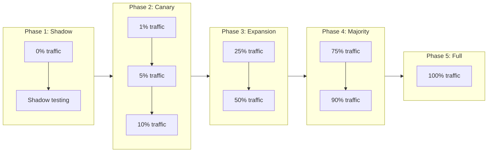

# Canary Deployment Strategy: FastAPI Migration

This document outlines the progressive rollout strategy for the FastAPI migration.

---

## Overview

Instead of a big-bang switch, we use a canary deployment approach to gradually shift traffic from Flask/Gunicorn to FastAPI/Uvicorn while monitoring for regressions.



---

## Phase 1: Shadow Testing (0% Real Traffic)

**Duration:** 1-2 weeks

> ⚠️ **Note:** True shadow testing (mirroring live requests) is complex in WSGI/ASGI environments because request bodies are streams that can only be read once. Instead, we recommend **replay testing** with recorded requests.

### Option A: Replay Testing (RECOMMENDED)

Record production requests and replay them against both servers for comparison.

```python
# scripts/shadow_replay_test.py
"""
Replay recorded requests against Flask and FastAPI servers for comparison.

Usage:
    python shadow_replay_test.py --flask-url http://localhost:8080 \
                                  --fastapi-url http://localhost:8081 \
                                  --requests-file recorded_requests.jsonl
"""
import asyncio
import json
import logging
import time
from dataclasses import dataclass
from pathlib import Path
from typing import List, Dict, Any, Optional

import httpx
from deepdiff import DeepDiff

logger = logging.getLogger(__name__)


@dataclass
class RequestRecord:
    """Recorded request for replay."""
    method: str
    path: str
    headers: Dict[str, str]
    body: bytes
    timestamp: float
    
    @classmethod
    def from_dict(cls, d: dict) -> "RequestRecord":
        return cls(
            method=d["method"],
            path=d["path"],
            headers=d.get("headers", {}),
            body=bytes.fromhex(d.get("body_hex", "")) if d.get("body_hex") else b"",
            timestamp=d.get("timestamp", 0)
        )


@dataclass
class ComparisonResult:
    """Result of comparing Flask vs FastAPI responses."""
    request_path: str
    flask_status: int
    fastapi_status: int
    flask_latency_ms: float
    fastapi_latency_ms: float
    response_diff: Optional[str]  # None if identical
    error: Optional[str]


async def replay_request(
    client: httpx.AsyncClient,
    base_url: str,
    record: RequestRecord,
    timeout: float = 30.0
) -> tuple[int, bytes, float]:
    """Replay a single request and return status, body, latency."""
    start = time.perf_counter()
    try:
        response = await client.request(
            method=record.method,
            url=f"{base_url}{record.path}",
            headers={k: v for k, v in record.headers.items() 
                    if k.lower() not in ("host", "content-length")},
            content=record.body,
            timeout=timeout
        )
        latency = (time.perf_counter() - start) * 1000
        return response.status_code, response.content, latency
    except Exception as e:
        latency = (time.perf_counter() - start) * 1000
        return 0, str(e).encode(), latency


async def compare_servers(
    flask_url: str,
    fastapi_url: str,
    records: List[RequestRecord],
    concurrency: int = 10
) -> List[ComparisonResult]:
    """Compare Flask and FastAPI responses for all recorded requests."""
    results = []
    semaphore = asyncio.Semaphore(concurrency)
    
    async with httpx.AsyncClient() as client:
        async def process_record(record: RequestRecord) -> ComparisonResult:
            async with semaphore:
                # Run both requests in parallel
                flask_task = replay_request(client, flask_url, record)
                fastapi_task = replay_request(client, fastapi_url, record)
                
                (flask_status, flask_body, flask_latency), \
                (fastapi_status, fastapi_body, fastapi_latency) = await asyncio.gather(
                    flask_task, fastapi_task
                )
                
                # Compare responses
                response_diff = None
                if flask_status == fastapi_status and flask_status == 200:
                    try:
                        flask_json = json.loads(flask_body)
                        fastapi_json = json.loads(fastapi_body)
                        diff = DeepDiff(flask_json, fastapi_json, 
                                       ignore_order=True,
                                       significant_digits=5)  # Allow float precision diff
                        if diff:
                            response_diff = str(diff)
                    except json.JSONDecodeError:
                        if flask_body != fastapi_body:
                            response_diff = f"Binary diff: {len(flask_body)} vs {len(fastapi_body)} bytes"
                elif flask_status != fastapi_status:
                    response_diff = f"Status mismatch: Flask={flask_status}, FastAPI={fastapi_status}"
                
                return ComparisonResult(
                    request_path=record.path,
                    flask_status=flask_status,
                    fastapi_status=fastapi_status,
                    flask_latency_ms=flask_latency,
                    fastapi_latency_ms=fastapi_latency,
                    response_diff=response_diff,
                    error=None
                )
        
        tasks = [process_record(r) for r in records]
        results = await asyncio.gather(*tasks, return_exceptions=True)
        
        # Handle exceptions
        final_results = []
        for i, result in enumerate(results):
            if isinstance(result, Exception):
                final_results.append(ComparisonResult(
                    request_path=records[i].path,
                    flask_status=0,
                    fastapi_status=0,
                    flask_latency_ms=0,
                    fastapi_latency_ms=0,
                    response_diff=None,
                    error=str(result)
                ))
            else:
                final_results.append(result)
        
        return final_results


def generate_report(results: List[ComparisonResult]) -> dict:
    """Generate summary report from comparison results."""
    total = len(results)
    errors = sum(1 for r in results if r.error)
    mismatches = sum(1 for r in results if r.response_diff and not r.error)
    
    flask_latencies = [r.flask_latency_ms for r in results if not r.error]
    fastapi_latencies = [r.fastapi_latency_ms for r in results if not r.error]
    
    def percentile(data: list, p: float) -> float:
        if not data:
            return 0
        sorted_data = sorted(data)
        k = (len(sorted_data) - 1) * p
        f = int(k)
        c = f + 1 if f + 1 < len(sorted_data) else f
        return sorted_data[f] + (sorted_data[c] - sorted_data[f]) * (k - f)
    
    return {
        "total_requests": total,
        "errors": errors,
        "response_mismatches": mismatches,
        "match_rate": f"{(total - errors - mismatches) / total * 100:.2f}%" if total else "N/A",
        "flask_latency": {
            "p50": percentile(flask_latencies, 0.5),
            "p95": percentile(flask_latencies, 0.95),
            "p99": percentile(flask_latencies, 0.99),
        },
        "fastapi_latency": {
            "p50": percentile(fastapi_latencies, 0.5),
            "p95": percentile(fastapi_latencies, 0.95),
            "p99": percentile(fastapi_latencies, 0.99),
        },
        "latency_improvement": {
            "p50": f"{(1 - percentile(fastapi_latencies, 0.5) / percentile(flask_latencies, 0.5)) * 100:.1f}%" 
                   if percentile(flask_latencies, 0.5) else "N/A",
            "p99": f"{(1 - percentile(fastapi_latencies, 0.99) / percentile(flask_latencies, 0.99)) * 100:.1f}%"
                   if percentile(flask_latencies, 0.99) else "N/A",
        }
    }


# CLI entry point
if __name__ == "__main__":
    import argparse
    
    parser = argparse.ArgumentParser(description="Shadow replay testing")
    parser.add_argument("--flask-url", required=True)
    parser.add_argument("--fastapi-url", required=True)
    parser.add_argument("--requests-file", required=True, type=Path)
    parser.add_argument("--concurrency", type=int, default=10)
    parser.add_argument("--output", type=Path, default=Path("shadow_test_results.json"))
    args = parser.parse_args()
    
    # Load recorded requests
    records = []
    with open(args.requests_file) as f:
        for line in f:
            records.append(RequestRecord.from_dict(json.loads(line)))
    
    print(f"Loaded {len(records)} requests for replay")
    
    # Run comparison
    results = asyncio.run(compare_servers(
        args.flask_url, args.fastapi_url, records, args.concurrency
    ))
    
    # Generate and print report
    report = generate_report(results)
    print(json.dumps(report, indent=2))
    
    # Save detailed results
    with open(args.output, "w") as f:
        json.dump({
            "summary": report,
            "results": [
                {
                    "path": r.request_path,
                    "flask_status": r.flask_status,
                    "fastapi_status": r.fastapi_status,
                    "flask_latency_ms": r.flask_latency_ms,
                    "fastapi_latency_ms": r.fastapi_latency_ms,
                    "diff": r.response_diff,
                    "error": r.error
                }
                for r in results
            ]
        }, f, indent=2)
```

### Option B: Request Recording Middleware

Add this middleware to production Flask to record requests for later replay:

```python
# request_recorder.py
"""Middleware to record requests for shadow testing."""
import json
import time
import threading
from io import BytesIO
from pathlib import Path
from queue import Queue

class RequestRecorderMiddleware:
    """
    WSGI middleware that records requests to a JSONL file.
    
    IMPORTANT: This reads and re-wraps wsgi.input to avoid breaking
    the downstream application.
    """
    
    def __init__(self, app, output_file: Path, sample_rate: float = 0.01):
        self.app = app
        self.output_file = output_file
        self.sample_rate = sample_rate  # Record 1% of requests by default
        self._queue = Queue()
        self._writer_thread = threading.Thread(target=self._writer_loop, daemon=True)
        self._writer_thread.start()
    
    def __call__(self, environ, start_response):
        import random
        
        # Sample requests
        if random.random() > self.sample_rate:
            return self.app(environ, start_response)
        
        # Only record prediction endpoints
        path = environ.get("PATH_INFO", "")
        if not any(p in path for p in ["/predict", "/transform", "/invocations"]):
            return self.app(environ, start_response)
        
        # Read and re-wrap the body (CRITICAL: don't break Flask!)
        try:
            content_length = int(environ.get("CONTENT_LENGTH", 0))
        except (ValueError, TypeError):
            content_length = 0
        
        body = b""
        if content_length > 0:
            body = environ["wsgi.input"].read(content_length)
            # Re-wrap so Flask can read it
            environ["wsgi.input"] = BytesIO(body)
        
        # Record the request
        record = {
            "timestamp": time.time(),
            "method": environ.get("REQUEST_METHOD", "GET"),
            "path": path,
            "headers": {
                k[5:].replace("_", "-").title(): v 
                for k, v in environ.items() 
                if k.startswith("HTTP_")
            },
            "body_hex": body.hex() if body else "",
            "content_type": environ.get("CONTENT_TYPE", ""),
        }
        self._queue.put(record)
        
        return self.app(environ, start_response)
    
    def _writer_loop(self):
        """Background thread to write records to file."""
        with open(self.output_file, "a") as f:
            while True:
                record = self._queue.get()
                f.write(json.dumps(record) + "\n")
                f.flush()
```

### Setup Instructions

1. **Record requests in production** (1-2 days):
   ```bash
   # Enable recording middleware with 1% sample rate
   export DRUM_RECORD_REQUESTS=true
   export DRUM_RECORD_SAMPLE_RATE=0.01
   ```

2. **Run replay test**:
   ```bash
   # Start both servers
   DRUM_SERVER_TYPE=flask drum server --address 0.0.0.0:8080 &
   DRUM_SERVER_TYPE=fastapi drum server --address 0.0.0.0:8081 &
   
   # Run comparison
   python scripts/shadow_replay_test.py \
       --flask-url http://localhost:8080 \
       --fastapi-url http://localhost:8081 \
       --requests-file /var/log/drum/recorded_requests.jsonl
   ```

### Success Criteria
- [ ] 100% response match rate (or documented acceptable differences)
- [ ] FastAPI P99 latency within 20% of Flask
- [ ] No OOM events during replay
- [ ] All error responses match between servers

---

## Phase 2: Canary (1% → 5% → 10%)

**Duration:** 2-3 weeks

### Traffic Splitting

#### Option A: Load Balancer (Recommended)

**NGINX Configuration:**
```nginx
upstream drum_flask {
    server flask-server:8080 weight=99;
}

upstream drum_fastapi {
    server fastapi-server:8080 weight=1;
}

# Canary split at 1%
split_clients "${remote_addr}${uri}" $backend {
    1%     drum_fastapi;
    *      drum_flask;
}

server {
    location /predict/ {
        proxy_pass http://$backend;
    }
}
```

**To increase to 5%:**
```nginx
split_clients "${remote_addr}${uri}" $backend {
    5%     drum_fastapi;
    *      drum_flask;
}
```

#### Option B: Feature Flag (Application Level)

```python
# In entry_point.py
import hashlib

def _get_server_type_with_canary() -> str:
    """Determine server type with canary percentage support."""
    
    # Check for explicit override first
    if RuntimeParameters.has("DRUM_SERVER_TYPE"):
        return str(RuntimeParameters.get("DRUM_SERVER_TYPE")).lower()
    
    # Check canary percentage
    canary_pct = float(RuntimeParameters.get("DRUM_FASTAPI_CANARY_PERCENT", 0))
    
    if canary_pct <= 0:
        return "flask"
    
    if canary_pct >= 100:
        return "fastapi"
    
    # Deterministic selection based on model ID for consistency
    model_id = os.environ.get("MLOPS_DEPLOYMENT_ID", "default")
    hash_value = int(hashlib.md5(model_id.encode()).hexdigest(), 16)
    
    if (hash_value % 100) < canary_pct:
        return "fastapi"
    
    return "flask"
```

### Monitoring Dashboard

Create a Grafana dashboard with:

```yaml
# grafana/dashboards/canary-comparison.json
panels:
  - title: "Request Rate by Server Type"
    query: |
      sum(rate(drum_requests_total[5m])) by (server_type)
  
  - title: "P99 Latency Comparison"
    query: |
      histogram_quantile(0.99, 
        sum(rate(drum_request_duration_seconds_bucket[5m])) by (le, server_type)
      )
  
  - title: "Error Rate Comparison"
    query: |
      sum(rate(drum_requests_total{status=~"5.."}[5m])) by (server_type)
      / sum(rate(drum_requests_total[5m])) by (server_type)
  
  - title: "Memory Usage Comparison"
    query: |
      avg(drum_memory_bytes{type="rss"}) by (server_type)
```

### Success Criteria for Each Step

| Metric | 1% Threshold | 5% Threshold | 10% Threshold |
|--------|--------------|--------------|---------------|
| Error rate | < 0.1% | < 0.1% | < 0.1% |
| P99 latency diff | < 30% | < 25% | < 20% |
| Memory diff | < 50% | < 40% | < 30% |
| OOM events | 0 | 0 | 0 |

### Automatic Rollback Triggers

```python
# monitoring/canary_watchdog.py
"""Automatic canary rollback based on metrics."""

import requests
from dataclasses import dataclass

@dataclass
class CanaryThresholds:
    max_error_rate: float = 0.01  # 1%
    max_latency_ratio: float = 1.5  # 50% slower
    max_memory_ratio: float = 1.5  # 50% more memory
    evaluation_window: str = "5m"

def check_canary_health(prometheus_url: str, thresholds: CanaryThresholds) -> bool:
    """Check if canary metrics are within thresholds."""
    
    # Query error rate
    error_rate_query = '''
        sum(rate(drum_requests_total{server_type="fastapi",status=~"5.."}[{window}]))
        / sum(rate(drum_requests_total{server_type="fastapi"}[{window}]))
    '''.format(window=thresholds.evaluation_window)
    
    error_rate = query_prometheus(prometheus_url, error_rate_query)
    if error_rate > thresholds.max_error_rate:
        logger.error("Canary error rate %.2f%% exceeds threshold %.2f%%", 
                    error_rate * 100, thresholds.max_error_rate * 100)
        return False
    
    # Query latency ratio
    latency_query = '''
        histogram_quantile(0.99, sum(rate(drum_request_duration_seconds_bucket{server_type="fastapi"}[{window}])) by (le))
        / histogram_quantile(0.99, sum(rate(drum_request_duration_seconds_bucket{server_type="flask"}[{window}])) by (le))
    '''.format(window=thresholds.evaluation_window)
    
    latency_ratio = query_prometheus(prometheus_url, latency_query)
    if latency_ratio > thresholds.max_latency_ratio:
        logger.error("Canary latency ratio %.2fx exceeds threshold %.2fx",
                    latency_ratio, thresholds.max_latency_ratio)
        return False
    
    return True

def trigger_rollback():
    """Trigger automatic rollback to Flask."""
    # Option 1: Update feature flag
    update_runtime_parameter("DRUM_FASTAPI_CANARY_PERCENT", 0)
    
    # Option 2: Update load balancer config
    # subprocess.run(["kubectl", "apply", "-f", "nginx-flask-only.yaml"])
    
    # Alert on-call
    send_pagerduty_alert("Canary rollback triggered due to metric regression")
```

---

## Phase 3: Expansion (25% → 50%)

**Duration:** 2 weeks

### Prerequisites
- [ ] All Phase 2 metrics within thresholds for 1 week
- [ ] No critical bugs reported
- [ ] Team sign-off

### Rollout Schedule

| Day | Percentage | Monitoring Period |
|-----|------------|-------------------|
| Day 1 | 25% | 48 hours |
| Day 3 | 35% | 24 hours |
| Day 4 | 50% | 72 hours |

### Additional Monitoring
- Customer-reported issues
- Support ticket volume
- MLOps metric ingestion success rate

---

## Phase 4: Majority (75% → 90%)

**Duration:** 1-2 weeks

### Prerequisites
- [ ] Phase 3 successful for 1 week
- [ ] No P0/P1 bugs
- [ ] Performance benchmarks match expectations

### Rollout Schedule

| Day | Percentage |
|-----|------------|
| Day 1 | 75% |
| Day 3 | 90% |

---

## Phase 5: Full Rollout (100%)

**Duration:** 1 week observation, then permanent

### Steps

1. **Set 100% traffic to FastAPI**
   ```bash
   export MLOPS_RUNTIME_PARAM_DRUM_FASTAPI_CANARY_PERCENT=100
   # or update load balancer
   ```

2. **Observation period** (1 week)
   - Monitor all metrics
   - Keep Flask ready for quick rollback

3. **Decommission Flask**
   - Remove Flask containers/instances
   - Update default in code
   - Add deprecation warnings

---

## Rollback Procedures

### Quick Rollback (< 5 minutes)

```bash
# Option 1: Feature flag
export MLOPS_RUNTIME_PARAM_DRUM_FASTAPI_CANARY_PERCENT=0

# Option 2: Load balancer
kubectl apply -f nginx-config-flask-only.yaml

# Option 3: Force server type
export MLOPS_RUNTIME_PARAM_DRUM_SERVER_TYPE=flask
```

### Gradual Rollback

If issues are non-critical, gradually reduce FastAPI traffic:

| Time | FastAPI % |
|------|-----------|
| T+0 | Current |
| T+15m | -50% |
| T+30m | -50% |
| T+45m | 0% |

---

## Communication Plan

### Before Each Phase

- [ ] Notify platform team
- [ ] Update status page
- [ ] Brief support team

### During Rollout

- [ ] Real-time Slack channel updates
- [ ] Hourly metric summaries
- [ ] Immediate notification on anomalies

### After Completion

- [ ] Summary report with metrics
- [ ] Lessons learned document
- [ ] Update runbooks

---

## Checklist Summary

### Phase 1 (Shadow)
- [ ] Shadow infrastructure deployed
- [ ] Mirroring working without errors
- [ ] Comparison metrics collected

### Phase 2 (Canary)
- [ ] Traffic splitting configured
- [ ] Monitoring dashboard ready
- [ ] Auto-rollback configured
- [ ] 1% → 5% → 10% successful

### Phase 3 (Expansion)
- [ ] 25% → 50% successful
- [ ] No customer-reported issues
- [ ] Support team comfortable

### Phase 4 (Majority)
- [ ] 75% → 90% successful
- [ ] Performance validated at scale

### Phase 5 (Full)
- [ ] 100% traffic on FastAPI
- [ ] 1 week observation complete
- [ ] Flask decommissioned
- [ ] Default changed in code
