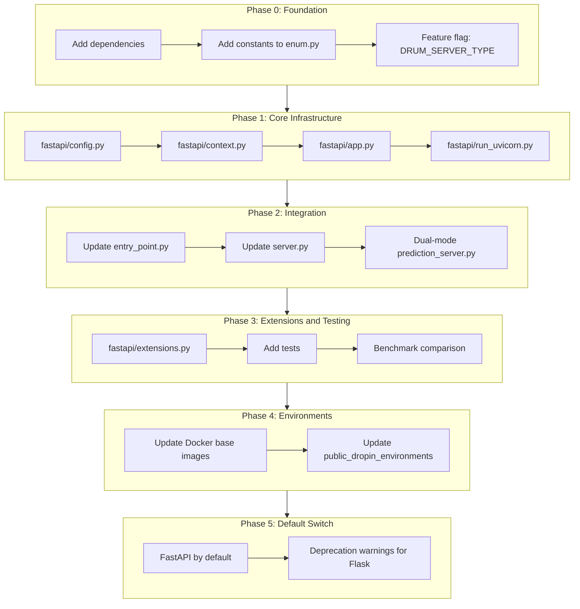
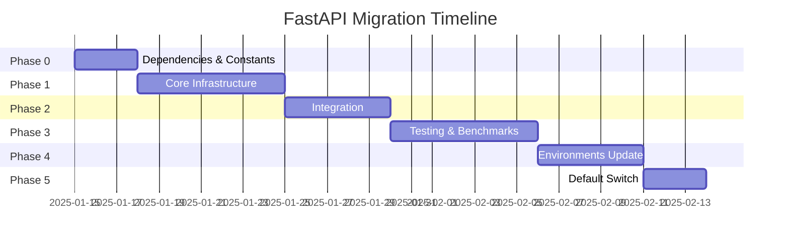

# FastAPI: Phased Implementation Plan

This plan describes the step-by-step introduction of FastAPI/Uvicorn parallel to the existing Flask/Gunicorn servers in DRUM. Each phase is self-contained and does not break existing functionality.

## Overview

Phased implementation of FastAPI/Uvicorn parallel to existing Flask/Gunicorn servers with switching via the `DRUM_SERVER_TYPE` runtime parameter.



---

## Phase 0: Foundation

**Goal:** Add dependencies and constants without changing behavior.

### 0.1 Update dependencies

File: [`custom_model_runner/requirements.txt`](../custom_model_runner/requirements.txt)

```
# Existing
flask>=2.0.0
gunicorn>=20.0.0
gevent>=21.0.0

# Add for FastAPI support
fastapi>=0.100.0
uvicorn[standard]>=0.23.0
httpx>=0.24.0
```

### 0.2 Add constants

File: [`custom_model_runner/datarobot_drum/drum/enum.py`](../custom_model_runner/datarobot_drum/drum/enum.py)

- Add `FASTAPI_EXT_FILE_NAME = "custom_fastapi"`
- Add constants for Uvicorn configuration: `DRUM_SERVER_TYPE`, `DRUM_FASTAPI_EXECUTOR_WORKERS`, `DRUM_UVICORN_LOOP`, etc.

**Completion Criterion:** Importing enum.py does not fail, tests pass.

---

## Phase 1: Core Infrastructure

**Goal:** Create an isolated `fastapi/` module without integration with the main code.

### 1.1 Module Structure

```
custom_model_runner/datarobot_drum/drum/fastapi/
├── __init__.py      # Exports
├── config.py        # UvicornConfig dataclass
├── context.py       # FastAPIWorkerCtx (analogous to gunicorn/context.py)
├── app.py           # FastAPI app with lifespan
├── routes.py        # NEW: Route definitions (separated from logic)
├── run_uvicorn.py   # Launcher (analogous to run_gunicorn.py)
├── extensions.py    # custom_fastapi.py loading
└── otel.py          # OTel middleware for FastAPI
```

### 1.2 Key Components

| File | Description | Analog in Flask/Gunicorn |
|------|----------|-------------------------|
| `config.py` | Parsing RuntimeParameters into Uvicorn config | gunicorn.conf.py |
| `context.py` | Worker lifecycle management + back-pressure | gunicorn/context.py |
| `app.py` | ASGI entry point with lifespan events | gunicorn/app.py |
| `routes.py` | Routes /predict, /ping, etc. | prediction_server.py (partial) |
| `run_uvicorn.py` | Subprocess launcher for Uvicorn | run_gunicorn.py |

**Completion Criterion:** Module is imported but not yet called from main code.

---

## Phase 2: Integration

**Goal:** Connect FastAPI to entry point with selection via `DRUM_SERVER_TYPE`.

### 2.1 Update entry_point.py

File: [`custom_model_runner/datarobot_drum/drum/entry_point.py`](../custom_model_runner/datarobot_drum/drum/entry_point.py)

```python
def run_drum_server():
    options = setup_options()
    if options.subparser_name != ArgumentsOptions.SERVER:
        main()
        return
    
    server_type = _get_server_type()  # flask | gunicorn | fastapi
    
    if server_type == "gunicorn":
        from datarobot_drum.drum.gunicorn.run_gunicorn import main_gunicorn
        main_gunicorn()
    elif server_type == "fastapi":
        from datarobot_drum.drum.fastapi.run_uvicorn import main_uvicorn
        main_uvicorn()
    else:
        main()  # Default Flask dev server
```

### 2.2 Update server.py

File: [`custom_model_runner/datarobot_drum/drum/server.py`](../custom_model_runner/datarobot_drum/drum/server.py)

- Add `create_fastapi_app()` alongside `get_flask_app()`
- Add `get_fastapi_app(router, app)` for router registration

### 2.3 Dual-mode PredictionServer

File: [`custom_model_runner/datarobot_drum/drum/root_predictors/prediction_server.py`](../custom_model_runner/datarobot_drum/drum/root_predictors/prediction_server.py)

Update `materialize()` to support both modes:

```python
def materialize(self):
    if isinstance(self.app, FastAPI) or self._is_fastapi_mode():
        return self._materialize_fastapi()
    else:
        return self._materialize_flask()
```

**Completion Criterion:** `DRUM_SERVER_TYPE=fastapi` starts Uvicorn, default is Flask.

---

## Phase 3: Extensions and Testing

**Goal:** Support for user extensions and full test coverage.

### 3.1 Loading custom_fastapi.py

File: `custom_model_runner/datarobot_drum/drum/fastapi/extensions.py`

- Searches for `custom_fastapi.py` in code_dir
- Calls `init_app(app: FastAPI)` to register middleware/routers

### 3.2 Add tests

| Test File | Description |
|------------|----------|
| `tests/unit/drum/fastapi/test_config.py` | Unit tests for UvicornConfig |
| `tests/unit/drum/fastapi/test_context.py` | Unit tests for FastAPIWorkerCtx |
| `tests/functional/test_drum_server_fastapi.py` | Functional tests for FastAPI server |
| `tests/functional/test_custom_fastapi_extensions.py` | Tests for custom_fastapi.py |

### 3.3 Benchmark comparison

Perform benchmarks Flask vs FastAPI:
- Throughput (requests/sec)
- Latency (p50, p95, p99)
- Memory footprint

**Completion Criterion:** All existing tests pass, new tests cover FastAPI.

---

## Phase 4: Environments

**Goal:** Update Docker images and public environments.

### 4.1 Update base images

Files:
- [`docker/dropin_env_base/Dockerfile`](../docker/dropin_env_base/Dockerfile)
- [`docker/dropin_env_base_jdk/Dockerfile`](../docker/dropin_env_base_jdk/Dockerfile)
- [`docker/dropin_env_base_r/Dockerfile`](../docker/dropin_env_base_r/Dockerfile)

Add:
```dockerfile
RUN pip install fastapi uvicorn[standard] httpx
```

### 4.2 Update public_dropin_environments

Add `fastapi`, `uvicorn`, `httpx` to requirements.txt of all environments.

**Completion Criterion:** Docker images build, environments work with FastAPI.

---

## Phase 5: Default Switch (Optional, after stabilization)

**Goal:** Make FastAPI the default server.

### 5.1 Change default

```python
def _get_server_type() -> str:
    if not RuntimeParameters.has("DRUM_SERVER_TYPE"):
        return "fastapi"  # Changed from "flask"
    ...
```

### 5.2 Deprecation warnings

Add warnings when using Flask:
```python
if server_type == "flask":
    warnings.warn(
        "Flask server is deprecated and will be removed in a future release. "
        "Use DRUM_SERVER_TYPE=fastapi for the new FastAPI server.",
        DeprecationWarning
    )
```

---

## Timeline and Parallel Work



---

## Server Selection (Runtime)

| `DRUM_SERVER_TYPE` | Server | Status |
|--------------------|--------|--------|
| `flask` (default) | Flask dev server | Stable |
| `gunicorn` | Gunicorn + Flask | Stable |
| `fastapi` / `uvicorn` | Uvicorn + FastAPI | New |

Example usage:
```bash
export MLOPS_RUNTIME_PARAM_DRUM_SERVER_TYPE=fastapi
drum server --code-dir ./model --target-type regression --address 0.0.0.0:8080
```

---

## Risks and Mitigation

| Risk | Mitigation |
|------|------------|
| Incompatibility with user `custom_flask.py` | Automatic fallback to Flask + Dual support period |
| Differences in trailing slash behavior | Use `APIRouter(redirect_slashes=True)` |
| Event loop blocking by sync code | Semaphore for limiting concurrent sync requests + ThreadPoolExecutor |
| Memory footprint (large files) | Use `SpooledTemporaryFile` for handling multipart/form-data |
| Outdated OpenTelemetry patch | Version check for `opentelemetry` + fallback to standard behavior |
| Performance issues | Benchmark-driven tuning of `DRUM_FASTAPI_EXECUTOR_WORKERS` |

---

## Checklist by Phases

### Phase 0: Foundation
- [ ] Add FastAPI dependencies to requirements.txt
- [ ] Add constants DRUM_SERVER_TYPE and FASTAPI_* to enum.py

### Phase 1: Core Infrastructure
- [ ] Create fastapi/config.py with UvicornConfig
- [ ] Create fastapi/context.py with FastAPIWorkerCtx
- [ ] Create fastapi/app.py with lifespan events
- [ ] Create fastapi/run_uvicorn.py launcher

### Phase 2: Integration
- [ ] Update entry_point.py for server selection
- [ ] Add create_fastapi_app() to server.py
- [ ] Add _materialize_fastapi() to prediction_server.py

### Phase 3: Extensions and Testing
- [ ] Create fastapi/extensions.py for custom_fastapi.py
- [ ] Add unit and functional tests for FastAPI

### Phase 4: Environments
- [ ] Update Docker base images with FastAPI deps
- [ ] Update public_dropin_environments
