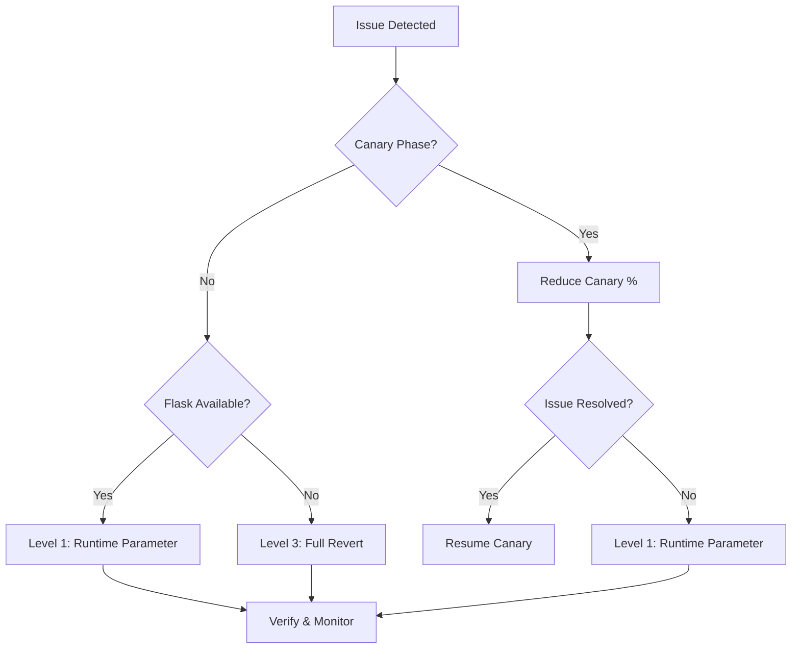

# Rollback Plan: FastAPI Migration

This document outlines the procedures for reverting from FastAPI to Flask in case of critical failures or regressions discovered during or after the migration.

## Related Documentation

- [CANARY_DEPLOYMENT.md](CANARY_DEPLOYMENT.md) - Progressive rollout with automatic rollback
- [OBSERVABILITY_MIGRATION.md](OBSERVABILITY_MIGRATION.md) - Metrics for monitoring rollback triggers

---

## Rollback Strategy Overview



---

## Proactive Rollback (Canary Phase)

**When:** During [Canary Deployment](CANARY_DEPLOYMENT.md) (M5)

### Gradual Reduction

If metrics exceed thresholds during canary, reduce FastAPI traffic gradually:

| Current % | Action | Wait Time |
|-----------|--------|-----------|
| > 50% | Reduce to 50% | 15 min |
| 25-50% | Reduce to 25% | 15 min |
| 10-25% | Reduce to 5% | 15 min |
| 1-10% | Reduce to 0% | - |

### Automatic Rollback Triggers

See [CANARY_DEPLOYMENT.md](CANARY_DEPLOYMENT.md#automatic-rollback-triggers) for metrics thresholds.

| Metric | Threshold | Action |
|--------|-----------|--------|
| Error rate | > 1% | Immediate rollback to 0% |
| P99 latency | > 50% increase | Gradual reduction |
| Memory usage | > 50% increase | Gradual reduction |
| OOM events | Any | Immediate rollback |

---

## Rollback Levels

### Level 1: Runtime Parameter (Immediate)

**When:** Issue in running environment that still has Flask installed.

**Time to Recovery:** < 5 minutes

**Action:** Change `DRUM_SERVER_TYPE` from `fastapi` back to `flask`.

**Scope:** Individual model deployments or local DRUM runs.

**Procedure:**
```bash
# Option A: Environment variable
export MLOPS_RUNTIME_PARAM_DRUM_SERVER_TYPE=flask

# Option B: Kubernetes ConfigMap
kubectl patch configmap drum-config -p '{"data":{"DRUM_SERVER_TYPE":"flask"}}'

# Option C: DataRobot Runtime Parameters (via API or UI)
# Set DRUM_SERVER_TYPE=flask in deployment settings
```

**Checklist:**
- [ ] Set `MLOPS_RUNTIME_PARAM_DRUM_SERVER_TYPE=flask`
- [ ] Restart the server/container
- [ ] Verify "Starting Flask server" appears in logs
- [ ] Verify `/info` returns `"drum_server": "flask"`
- [ ] Run smoke test predictions

### Level 2: Default Switch Reversal (M6 Phase)

**When:** Default has been changed to `fastapi` in code, but Flask is still present.

**Time to Recovery:** 30 minutes - 2 hours (hotfix release)

**Action:** Revert the default value in `entry_point.py`.

**Scope:** All new DRUM runs using the updated package.

**Procedure:**
1. Create hotfix branch:
   ```bash
   git checkout -b hotfix/revert-fastapi-default main
   ```

2. Modify `custom_model_runner/datarobot_drum/drum/entry_point.py`:
   ```python
   def _get_server_type() -> str:
       if not RuntimeParameters.has("DRUM_SERVER_TYPE"):
           return "flask"  # Revert from "fastapi"
   ```

3. Update version and create release:
   ```bash
   # Bump patch version
   # Run tests
   # Create release
   ```

4. Deploy hotfix:
   ```bash
   pip install datarobot-drum==X.Y.Z-hotfix
   ```

### Level 3: Full Code & Image Revert (Post-Decommissioning)

**When:** Flask and Gunicorn have been removed from base images and codebase.

**Time to Recovery:** 2 - 4 hours

**Action:** Revert to the last stable git tag before Flask removal.

**Scope:** Global infrastructure.

**Procedure:**

1. **Identify last stable tag:**
   ```bash
   # Find last tag with Flask support
   git log --oneline --tags | grep -i "flask"
   ```

2. **Docker images:**
   ```bash
   # Re-tag previous base images
   docker pull datarobot/drum-base:v1.2.3-with-flask
   docker tag datarobot/drum-base:v1.2.3-with-flask datarobot/drum-base:latest
   docker push datarobot/drum-base:latest
   ```

3. **Code revert:**
   ```bash
   # Revert commits from REMOVING_FLASK_STRATEGY.md
   git revert --no-commit <commit-hash-1>
   git revert --no-commit <commit-hash-2>
   git commit -m "Revert Flask removal for emergency rollback"
   ```

4. **CI/CD:**
   - Trigger full build
   - Deploy to all environments
   - Update Kubernetes deployments

---

## Critical Triggers for Rollback

### Immediate Rollback (Level 1)

| Trigger | Detection | Threshold |
|---------|-----------|-----------|
| Memory Leak | RSS growth in `/stats/` | > 10% growth/hour |
| Deadlock | No response to `/ping` | > 30s timeout |
| Data Corruption | Prediction diff | Any difference |
| Security Incident | Alerts | Any severity |

### Gradual Rollback (Canary Reduction)

| Trigger | Detection | Threshold |
|---------|-----------|-----------|
| Latency Regression | P99 comparison | > 20% increase |
| Error Rate Increase | 5xx responses | > 0.1% |
| Extension Failures | User reports | > 3 reports |
| OTel Missing | Trace gaps | Any gaps |

---

## Verification After Rollback

After any rollback operation, verify:

### Immediate Checks (< 5 minutes)

- [ ] `/ping` returns 200 OK
- [ ] `/health/` returns 200 OK
- [ ] `/info` shows `"drum_server": "flask"`
- [ ] No `FastAPI` or `Uvicorn` errors in logs

### Functional Checks (< 15 minutes)

- [ ] Single prediction succeeds
- [ ] Batch prediction succeeds
- [ ] `/stats/` returns valid metrics
- [ ] MLOps metrics are flowing

### Full Verification (< 1 hour)

- [ ] Load test passes
- [ ] All model types work (regression, classification, unstructured)
- [ ] Custom extensions (`custom_flask.py`) load correctly
- [ ] OTel traces appear in monitoring

---

## Communication During Rollback

### Internal

1. **Slack:** Post to #drum-incidents
2. **PagerDuty:** Acknowledge incident
3. **JIRA:** Create incident ticket

### External (if customer-facing)

1. **Status Page:** Update status
2. **Support:** Brief support team
3. **Documentation:** Note in release notes

---

## Post-Rollback Actions

1. **Root Cause Analysis:**
   - Collect logs from affected period
   - Identify triggering conditions
   - Document in incident report

2. **Fix Development:**
   - Create fix in separate branch
   - Add regression test
   - Review with team

3. **Re-deployment Plan:**
   - Shadow testing first
   - Canary with lower percentages
   - Extended observation period

---

## Emergency Contacts

| Role | Contact | Escalation |
|------|---------|------------|
| On-call Engineer | PagerDuty | Automatic |
| Tech Lead | @tech-lead | After 15 min |
| Platform Team | #platform-team | After 30 min |
